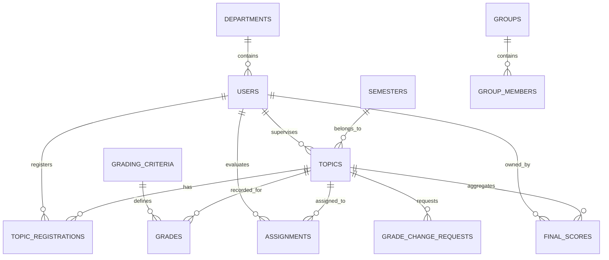

# THESIS LIFE - Cẩm Nang Đọc Hiểu Mã Nguồn Hệ Thống Quản Lý Khóa Luận

Tài liệu này được biên soạn để giúp bạn nhanh chóng làm quen, đọc hiểu và làm chủ toàn bộ mã nguồn của dự án **Hệ Thống Quản Lý Khóa Luận Tốt Nghiệp** bao gồm cả 3 phần: **Backend**, **Frontend Web**, và **Mobile App**.

---

## 1. Cấu Trúc Tổng Quan Dự Án (Monorepo)

Thư mục gốc của dự án được tổ chức thành 3 phần độc lập nhưng chia sẻ chung thiết kế API và cơ sở dữ liệu:
* **`thesis-be/`**: Backend API viết bằng Node.js (sử dụng NestJS/Express, Prisma ORM, PostgreSQL). Chịu trách nhiệm lưu trữ cơ sở dữ liệu, quản lý phiên làm việc (JWT Auth), tính toán điểm tổng kết theo trọng số và phân quyền.
* **`thesis-fe/`**: Frontend Client dành cho Quản trị viên (Admin), Trưởng bộ môn (HEAD), Điều phối viên (COORDINATOR), Giảng viên (Lecturer), và Sinh viên. Viết bằng **React + TypeScript + Vite** và tạo kiểu bằng CSS/Tailwind.
* **`thesis-mobile/`**: Ứng dụng Mobile viết bằng **Expo (React Native) + TypeScript**. Phục vụ chủ yếu cho Giảng viên (nhập điểm cơ động, xem lịch hội đồng) và Sinh viên (theo dõi đề tài, xem kết quả điểm số).

---

## 2. Phân Tích Frontend Web (`thesis-fe`)

Dưới đây là sơ đồ luồng hoạt động chính và danh sách các file cốt lõi ở Web:

### A. Định Tuyến & Xác Thực (Routing & Auth)
* **`src/App.tsx` & `src/routes.tsx`**:
  * Định nghĩa tất cả các router trong hệ thống (Public route như Login và Protected route như Dashboard, Topics, Evaluation, Settings).
  * Sử dụng `<ProtectedRoute allowedRoles={[...]}>` để chặn truy cập trái phép. Nếu vai trò của user (`user.role`) không nằm trong danh sách được phép, hệ thống tự động trả về trang `/unauthorized` hoặc trang chủ.
* **`src/store/auth.ts`**:
  * Quản lý trạng thái đăng nhập bằng thư viện **Zustand** (lưu `user`, `accessToken`, `refreshToken`). Trạng thái này được đồng bộ xuống `localStorage` để không bị mất khi F5 trang.

### B. Các Trang Chức Năng Chính (`src/pages/`)
1. **`Topics.tsx` (Quản lý đề tài)**:
   * Cho phép Sinh viên xem danh sách đề tài mở, đăng ký đề tài theo nhóm.
   * Cho phép Giảng viên thêm mới, phê duyệt hoặc chỉnh sửa đề tài.
   * **Sanitization**: Chứa các hàm loại bỏ thông tin thừa trong nhận xét giữa kỳ (ví dụ: chuỗi tự động của hệ thống `(Hệ thống cập nhật theo yêu cầu)`).
2. **`Evaluation.tsx` (Chấm điểm & Đánh giá)**:
   * Trang trung tâm dành cho giảng viên chấm điểm. Gồm 4 tab:
     * **Hướng dẫn (Advisor)**: Chấm điểm cho các nhóm mình trực tiếp hướng dẫn.
     * **Phản biện (Reviewer)**: Chấm điểm với tư cách là giảng viên phản biện 1 hoặc phản biện 2.
     * **Hội đồng (Committee)**: Nhập điểm khi ngồi trong hội đồng bảo vệ (Chủ tịch, Thư ký, Ủy viên).
     * **Quản lý bộ môn (Department)**: Chỉ dành cho **HEAD** và **COORDINATOR** để xem tổng hợp điểm số của toàn bộ các đề tài trong khoa và phê duyệt các điểm trễ hạn.
3. **`FinalResults.tsx` (Kết quả khóa luận)**:
   * Hiển thị bảng tổng hợp điểm cuối cùng của sinh viên gồm điểm thành phần và điểm tổng kết theo trọng số.
   * Chứa bộ lọc 3 chế độ: **Tất cả (All)**, **Bảo vệ Oral (Oral)**, **Bảo vệ Poster (Poster)**.
   * Cập nhật số đếm (Topic Count) động dạng pill-badge ở tiêu đề tab filter mà không dùng dấu ngoặc tròn (ví dụ: `Oral 12` thay vì `Oral (12)`).
4. **`head/SemesterSettings.tsx` (Cài đặt học kỳ)**:
   * Dành cho HEAD, COORDINATOR, và ADMIN cấu hình các mốc thời gian (Thời hạn đăng ký, nộp bài, thời hạn chấm điểm của GVHD, GVPB, Hội đồng).

---

## 3. Phân Tích Ứng Dụng Mobile (`thesis-mobile`)

Ứng dụng Mobile sử dụng **Expo Router** (định tuyến theo cấu trúc thư mục dạng file-system).

### A. Cấu Trúc Thư Mục `app/` (Expo Router)
* **`app/_layout.tsx`**: Khởi tạo ứng dụng, thiết lập Context Provider cho React Query, cấu hình StatusBar và Load Fonts.
* **`app/(auth)/login.tsx`**: Trang đăng nhập của hệ thống.
* **`app/(tabs)/`**: Tab navigation chính của ứng dụng sau khi đăng nhập:
  * `assigned.tsx`: Danh sách đề tài được phân công cho giảng viên chấm điểm.
  * `index.tsx` (Dashboard): Thống kê nhanh số lượng đề tài, lịch hội đồng.
  * `profile.tsx`: Thông tin cá nhân và nút Đăng xuất.

### B. Luồng Nhập Điểm & Đánh Giá Đề Tài (Grading Flow)
Luồng đi từ Danh sách đề tài -> Chi tiết đề tài -> Bảng điểm tổng hợp -> Form chấm điểm:

```mermaid
graph TD
    A["assigned.tsx (Danh sách đề tài phân công)"] -->|Click Đề tài| B["topic/[topicId]/index.tsx (Chi tiết đề tài)"]
    B -->|Click Xem bảng điểm / Chỉnh sửa| C["topic/[topicId]/grade-review/[studentId].tsx (Xem lại điểm)"]
    C -->|Click Chỉnh sửa (nếu có quyền)| D["topic/[topicId]/grading/[studentId].tsx (Nhập điểm chi tiết)"]
```

1. **`app/topic/[topicId]/index.tsx` (Chi tiết đề tài)**:
   * Hiển thị thông tin đề tài, danh sách sinh viên thực hiện, phòng bảo vệ và thời gian cụ thể.
   * Kiểm tra quyền để hiển thị nút CTA phù hợp:
     * Nếu user là **Spectator** (HOD/Coordinator không trực tiếp chấm đề tài này): Nút hiển thị là **"Xem bảng điểm"** và đưa sang màn hình `grade-review` dạng chỉ đọc.
     * Nếu user là **Grader** (Giảng viên trực tiếp được phân công chấm đề tài này): Nút hiển thị là **"Bắt đầu nhập điểm"** hoặc **"Chỉnh sửa điểm"** để đi thẳng vào màn màn chấm điểm.
2. **`app/topic/[topicId]/grade-review/[studentId].tsx` (Xem lại điểm)**:
   * Cho phép xem điểm tổng kết cuối cùng, điểm trung bình của từng nhóm vai trò (GVHD, GVPB, Hội đồng) và lịch sử chỉnh sửa điểm.
   * Nếu user có phân công chấm điểm trực tiếp và điểm chưa bị khóa (Finalized), footer sẽ xuất hiện nút **"Chỉnh sửa"** để chuyển sang trang nhập điểm.
3. **`app/topic/[topicId]/grading/[studentId].tsx` (Form chấm điểm chi tiết)**:
   * Hiển thị danh sách tiêu chí chấm điểm tương ứng với vai trò của giảng viên (lấy động từ API tiêu chí).
   * Cho phép nhập điểm cho từng tiêu chí (từ 0 đến max_score) và viết nhận xét chi tiết.
   * Chứa tính năng lưu nháp ngoại tuyến (Offline Draft) để chống mất dữ liệu khi mất mạng đột ngột.

---

## 4. Cơ Chế Gọi API & Đồng Bộ Dữ Liệu

Dự án áp dụng các giải pháp kiến trúc hiện đại để tối ưu hóa hiệu năng và trải nghiệm người dùng:

### A. Axios Client & Tự Động Làm Mới Token (`api/client.ts`)
* Gửi kèm Header `Authorization: Bearer <AccessToken>` trong mọi request nếu người dùng đã đăng nhập.
* **Cơ chế Token Refresh (Interceptor)**:
  * Khi Server phản hồi lỗi `401 Unauthorized` (do access token hết hạn), Interceptor sẽ tạm dừng (queue) toàn bộ các request tiếp theo.
  * Tự động gọi API `/auth/refresh-token` gửi kèm `refreshToken` để lấy cặp AccessToken/RefreshToken mới.
  * Cập nhật token mới vào Zustand Store.
  * Thực hiện lại (retry) các request bị lỗi trước đó một cách mượt mà mà người dùng không hề hay biết.

### B. React Query (Quản lý trạng thái bất đồng bộ)
* Cả Web và Mobile đều sử dụng thư viện **React Query** (`@tanstack/react-query`) để gọi API thay vì dùng `useEffect` thủ công.
* **Lợi ích**:
  * Tự động cache dữ liệu (tránh gọi trùng lặp API khi chuyển trang).
  * Tự động gọi lại API để đồng bộ dữ liệu ngầm khi thiết bị kết nối mạng lại (refetch on reconnect/focus).
  * Quản lý trạng thái tải (`isLoading`), làm mới (`isRefetching`) và lỗi (`error`) một cách đồng bộ và ngắn gọn.

### C. Lưu Trữ Ngoại Tuyến (Offline Storage trên Mobile - `api/offline.ts`)
* Sử dụng `@react-native-async-storage/async-storage` để lưu trữ tạm các điểm số và bình luận mà giảng viên nhập dưới dạng bản nháp (Draft).
* Khi nhấn "Lưu nháp", bản nháp được ghi xuống bộ nhớ điện thoại. Khi có kết nối mạng ổn định, giảng viên nhấn "Gửi điểm" (Submit) để đẩy dữ liệu chính thức lên máy chủ.

---

## 5. Logic Phân Quyền & Quy Trình Tính Điểm Khóa Luận

Hiểu rõ quy trình tính toán điểm số giúp bạn tự tin bảo vệ đồ án:

### A. Cách Tính Điểm Cuối Kỳ
Điểm tổng kết cuối kỳ của một sinh viên được tính theo công thức trọng số được định nghĩa ở Backend:
$$\text{Điểm Tổng Kết} = (\text{Điểm GVHD} \times W_{HD}) + (\text{Điểm TB GVPB} \times W_{PB}) + (\text{Điểm TB Hội Đồng} \times W_{HDBV}) + \text{Điểm Thưởng NCKH}$$
* Trong đó, nếu đề tài có 2 phản biện, **Điểm TB GVPB** là trung bình cộng điểm của 2 phản biện.
* **Điểm TB Hội Đồng** là trung bình cộng điểm của tất cả thành viên trong hội đồng bảo vệ có mặt chấm điểm.

### B. Logic Phân Quyền Vai Trò
* **ADMIN**: Toàn quyền quản trị hệ thống (Quản lý tài khoản, phân quyền, cấu hình hệ thống).
* **HEAD / COORDINATOR**:
  * Quản lý hoạt động chuyên môn của bộ môn/khoa.
  * Xem toàn bộ điểm số nháp và lịch sử chấm điểm của tất cả đề tài.
  * Thực hiện chốt (Lock/Finalize) điểm số sau khi hết thời hạn phúc khảo.
  * *Lưu ý*: Vẫn có thể tham gia chấm điểm bình thường nếu được phân công trực tiếp làm GVHD, GVPB hoặc ngồi Hội đồng.
* **LECTURER (Giảng viên thường)**:
  * Chỉ được chấm điểm và xem điểm của các đề tài mình được phân công chấm trực tiếp.
  * Không có quyền xem điểm của các giảng viên thuộc nhóm vai trò khác chấm cho cùng một đề tài (ví dụ: GV phản biện không được xem điểm của GVHD chấm cho đến khi điểm được công bố công khai).
* **STUDENT (Sinh viên)**:
  * Xem thông tin đề tài của nhóm mình.
  * Xem kết quả điểm số thành phần và điểm tổng kết kèm theo xếp loại học lực thang điểm 4 và thang điểm chữ (A+, A, B+, B...) sau khi điểm đã được chốt (Finalized).

---

## 6. Thiết Kế Cơ Sở Dữ Liệu & Các Thực Thể Chính (Prisma Schema)

Hệ thống sử dụng cơ sở dữ liệu quan hệ PostgreSQL thông qua **Prisma ORM** ([schema.prisma](file:///d:/thesis/V2/thesis-be/prisma/schema.prisma)) để đảm bảo tính toàn vẹn của dữ liệu học thuật. Dưới đây là sơ đồ mối quan hệ thực thể (ERD) và phân tích các bảng chính:

### A. Sơ Đồ Thực Thể Chính (Mermaid ERD)


### B. Các Thực Thể Cốt Lõi
1. **`users`**:
   * Lưu thông tin tài khoản của toàn bộ hệ thống. Phân quyền thông qua trường `role` (`STUDENT`, `LECTURER`, `HEAD`, `ADMIN`, `COORDINATOR`).
   * Phân biệt sinh viên qua trường `student_code` và lớp qua `class_name`.
2. **`semesters` & `department_semester_configs`**:
   * `semesters` lưu cấu hình mốc thời gian toàn cục của đợt khóa luận (ngày đăng ký, ngày nộp đề xuất, ngày phản biện, ngày bảo vệ).
   * `department_semester_configs` cho phép Trưởng bộ môn mở/khóa cổng đăng ký đề tài riêng biệt hoặc ghi đè ngày bảo vệ cho từng bộ môn cụ thể mà không ảnh hưởng tới toàn khoa.
3. **`topics`**:
   * Trái tim của hệ thống. Liên kết với giảng viên đề xuất (`supervisor_id`), đồng hướng dẫn (`co_supervisor_id`), học kỳ (`semester_id`), bộ môn (`departmentId`).
   * Trạng thái đề tài được quản lý qua `status` (`DRAFT`, `PENDING_APPROVAL`, `APPROVED`, `REGISTERED`, `FINALIZED`).
   * Cờ `is_locked` dùng để khóa đề tài thủ công khi có tranh chấp, và `is_eligible_for_defense` chốt danh sách được phép bảo vệ cuối kỳ.
4. **`groups` & `group_members`**:
   * Hỗ trợ sinh viên ghép nhóm tự quản lý trước khi đăng ký đề tài. Trưởng nhóm (`leader_id`) có quyền gửi lời mời tham gia nhóm (`GroupInvite`) tới các thành viên khác.
5. **`topic_registrations`**:
   * Quản lý trạng thái đăng ký của sinh viên vào đề tài. Lưu trữ kết quả đánh giá giữa kỳ qua trường `midterm_status` (`PASS` hoặc `FAIL`).
6. **`assignments`**:
   * Phân công giảng viên chấm phản biện (`REVIEWER`) hoặc tham gia hội đồng (`COMMITTEE`). Quản lý lịch bảo vệ chi tiết (phòng, thời gian bắt đầu, kết thúc, link Zoom/password nếu bảo vệ online).
7. **`grading_criteria` & `grades`**:
   * `grading_criteria` định nghĩa bảng tiêu chí chấm điểm động (rubric) gồm tên tiêu chí, mô tả, trọng số (`weight`), điểm tối đa (`max_score`).
   * `grades` lưu trữ điểm số chi tiết cho từng tiêu chí mà giảng viên chấm cho sinh viên.
8. **`final_scores`**:
   * Bảng tổng hợp lưu trữ điểm trung bình cuối cùng sau khi tính toán trọng số của GVHD, GVPB, Hội đồng, điểm thưởng nghiên cứu khoa học (`extra_points`) và xếp loại học lực (`grade_classification`).
9. **`grade_change_requests` & `grade_history`**:
   * `grade_change_requests` quản lý quy trình xin sửa điểm của giảng viên khi điểm đã bị khóa hoặc quá thời hạn.
   * `grade_history` tự động ghi vết mọi sự thay đổi điểm số phục vụ mục đích hậu kiểm (audit trail).

---

## 7. Quy Trình Nghiệp Vụ Quan Trọng ở Backend (`thesis-be`)

Backend được viết bằng **Node.js + Express** và thiết kế theo mô hình kiến trúc phân lớp hướng dịch vụ (Service-Oriented Layered Architecture). Dưới đây là các luồng xử lý chính:

### A. Luồng Đăng Ký Đề Tài (`registration.service.ts`)
1. Sinh viên tạo nhóm (`Group`) -> Gửi lời mời tới bạn học -> Người nhận chấp nhận thư mời.
2. Trưởng nhóm tiến hành gửi yêu cầu đăng ký đề tài thông qua API.
3. `RegistrationService` gọi `AcademicPolicy.enforce(REGISTER_TOPIC)` để kiểm tra xem thời gian đăng ký của học kỳ có hợp lệ không.
4. Hệ thống kiểm tra giới hạn sĩ số của đề tài (`max_students`), cấu hình số lượng thành viên tối thiểu/tối đa của bộ môn (`min_group_size`, `max_group_size`).
5. Nếu hợp lệ, hệ thống chuyển trạng thái đăng ký thành `PENDING` và gửi thông báo tới Giảng viên hướng dẫn để duyệt sinh viên vào nhóm đề tài.

### B. Luồng Chấm Điểm & Tính Điểm Tổng Kết (`grading.service.ts`)
1. **Chấm điểm giữa kỳ:** Giảng viên hướng dẫn chấm `PASS` hoặc `FAIL` kèm nhận xét. Nếu chấm `FAIL`, hệ thống tự động khóa trạng thái đăng ký của sinh viên đó (`midterm_status = FAIL`, `status = FAILED`) để chặn các hoạt động học thuật tiếp theo.
2. **Chấm điểm cuối kỳ:**
   * Giảng viên gửi mảng điểm số tương ứng với các tiêu chí (`criterionId`).
   * Hệ thống tự động kiểm tra xem tổng trọng số của các tiêu chí có bằng `1.0` (100%) hay không để tránh sai lệch điểm số.
   * Lưu điểm vào bảng `Grade`.
3. **Tổng hợp và Chốt điểm:**
   * Khi gọi API tổng hợp điểm, `GradingService` lấy điểm trung bình của các nhóm rater (GVHD, trung bình GVPB, trung bình Hội đồng), áp dụng trọng số và cộng điểm thưởng từ `ExtraPointRequest` để ghi vào `FinalScore`.
   * Trưởng bộ môn gọi API chốt điểm (`FINALIZE_SCORE`) -> Chuyển cột `finalized` trong `FinalScore` thành `true` để khóa điểm vĩnh viễn và công bố điểm cho sinh viên.

### C. Luồng Yêu Cầu Sửa Điểm (`GradeChangeRequest`)
Do yêu cầu bảo mật, giảng viên không được tự ý sửa điểm trực tiếp sau khi đã gửi điểm hoặc quá thời hạn. Quy trình diễn ra như sau:
1. Giảng viên gửi yêu cầu sửa điểm kèm lý do và số điểm mới qua API.
2. Hệ thống tạo bản ghi `GradeChangeRequest` ở trạng thái `PENDING`.
3. Trưởng bộ môn (`HEAD`) xem xét yêu cầu trên dashboard quản trị.
4. Nếu **Phê duyệt (APPROVED)**:
   * Hệ thống ghi đè điểm mới vào bảng `Grade`.
   * Ghi lại nhật ký sửa điểm cũ và điểm mới vào `GradeHistory`.
   * Cập nhật trạng thái yêu cầu sửa điểm thành `APPROVED`.
   * Tự động tính toán lại điểm tổng kết cuối kỳ (`FinalScore`).
5. Nếu **Từ chối (REJECTED)**: Giữ nguyên điểm cũ, yêu cầu chuyển về trạng thái `REJECTED` kèm lý do từ chối.

---

## 8. Cẩm Nang Gỡ Lỗi & Bảo Trì Hệ Thống (Troubleshooting)

Trong quá trình vận hành thử nghiệm hoặc bảo vệ đồ án, bạn có thể gặp một số tình huống lỗi thường gặp. Dưới đây là cách định vị lỗi nhanh:

### A. Lỗi Lệch Múi Giờ Khi Kiểm Tra Giai Đoạn (Phase Shift Bug)
* **Triệu chứng:** Giảng viên hoặc sinh viên bị chặn API với thông báo `"Chỉ được phép đăng ký trong giai đoạn..."` dù thời gian thực tế vẫn nằm trong khung thời hạn.
* **Nguyên nhân:** Máy chủ backend chạy giờ UTC trong khi cơ sở dữ liệu lưu trữ múi giờ local, hoặc ngược lại.
* **Cách khắc phục:** Hệ thống đã được cấu hình chuẩn hóa múi giờ Việt Nam (`Asia/Ho_Chi_Minh`) qua thư viện `dayjs` trong tệp [dayjs.ts](file:///d:/thesis/V2/thesis-be/src/config/dayjs.ts). Khi cài đặt mốc thời gian trên hệ thống, cần đảm bảo gửi chuỗi định dạng ISO có múi giờ cụ thể (ví dụ: `2026-06-04T12:00:00+07:00`).

### B. Lỗi Không Thể Chấm Điểm Phản Biện
* **Triệu chứng:** Giảng viên phản biện nhận được thông báo lỗi `"Chưa thể chấm điểm phản biện do Giảng viên hướng dẫn chưa hoàn tất..."`.
* **Nguyên nhân:** Chính sách học thuật (`AcademicPolicy.canPerform`) bắt buộc phải có điểm số từ Giảng viên hướng dẫn trước để đảm bảo tính tuần tự của quy trình bảo vệ.
* **Cách khắc phục:** Kiểm tra trong bảng `grades` xem đề tài đó đã có bản ghi điểm của vai trò `SUPERVISOR` chưa. Nếu chưa, liên hệ giảng viên hướng dẫn của đề tài hoàn thành việc nhập điểm.

### C. Lỗi Gửi Điểm Di Động Báo Thất Bại Nhưng Đã Lưu Nháp
* **Triệu chứng:** Giảng viên bấm "Gửi điểm" trên app di động báo lỗi kết nối mạng nhưng trạng thái điểm không bị mất.
* **Nguyên nhân:** Tính năng Offline Storage lưu giữ điểm số tạm dưới dạng nháp cục bộ qua `AsyncStorage`.
* **Cách khắc phục:** Kiểm tra lịch sử gửi điểm hoặc hàng đợi đồng bộ. Khi điện thoại có kết nối ổn định lại, nhấn "Gửi lại" để đồng bộ dữ liệu từ hàng đợi lên backend.

---

## 9. Lời Khuyên Cho Buổi Bảo Vệ Đồ Án (Presentation Tips)

Khi trình bày đồ án trước hội đồng, hãy chú trọng giới thiệu các phần mang tính giải pháp kỹ thuật cao thay vì chỉ liệt kê chức năng CRUD thông thường:

1.  **Nhấn mạnh mô hình phân quyền chặt chẽ:** Hãy trình bày rõ sự kết hợp giữa **RBAC** (Phân quyền theo vai trò người dùng) và **ABAC** (Phân quyền theo ngữ cảnh/chính sách động học thuật). Đưa ra ví dụ về `AcademicPolicy` kiểm tra trạng thái trượt giữa kỳ hoặc thứ tự chấm điểm để chứng minh hệ thống có tính thực tiễn cao, chống gian lận điểm số.
2.  **Trình bày giải pháp đồng bộ ngoại tuyến (Offline Sync):** Đây là điểm cộng lớn cho ứng dụng di động. Giới thiệu cơ chế lưu trữ hàng đợi đồng bộ (`Sync Queue`) của `OfflineStorage` trên điện thoại khi chấm điểm ở các phòng bảo vệ sóng yếu.
3.  **Hệ thống vết lịch sử chỉnh sửa dữ liệu (Audit Trail):** Chứng minh tính minh bạch của phần mềm bằng cách chỉ ra bảng `AuditLog` ghi nhận lịch sử thay đổi thông tin hệ thống và `GradeHistory` theo dõi vết thay đổi điểm số của giảng viên.
4.  **Bảng tiêu chí động (Dynamic Rubrics):** Trình bày việc hệ thống không code cứng công thức và tiêu chí chấm điểm mà cho phép tùy biến linh hoạt theo quy chế riêng của từng Bộ môn hoặc Học kỳ.
