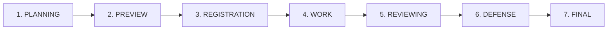

# 📅 QUY TRÌNH 7 GIAI ĐOẠN VÒNG ĐỜI HỌC KỲ (SEMESTER LIFECYCLE)
## HỆ THỐNG QUẢN LÝ KHÓA LUẬN TỐT NGHIỆP (TMS)

Tài liệu này chi tiết hóa các mốc thời gian, điều kiện chuyển đổi giai đoạn, cùng các luồng chức năng chính (Đầu vào, Đầu ra, Xử lý) xuyên suốt 7 giai đoạn trong học kỳ của hệ thống.

---

---

## GIAI ĐOẠN 1: PLANNING (Lập kế hoạch & Chuẩn bị)
Giai đoạn khởi tạo học kỳ mới, cấu hình hệ thống và chuẩn bị dữ liệu người dùng.

*   **Chức năng chính:** Khởi tạo học kỳ; Thiết lập cấu hình mốc thời gian toàn cục; Nhập danh sách Giảng viên và Sinh viên vào đợt làm khóa luận.
*   **Người thực hiện:** `ADMIN` (Quản trị viên) và `HEAD`/`COORDINATOR` (Trưởng bộ môn/Điều phối viên).
*   **Chi tiết luồng xử lý:**
    *   **Đầu vào (Input):**
        *   Tên học kỳ, mã học kỳ (ví dụ: `HK261`).
        *   Các mốc ngày bắt đầu/kết thúc dự kiến cho từng giai đoạn tiếp theo.
        *   File danh sách người dùng (họ tên, email, mã sinh viên, bộ môn, lớp).
    *   **Xử lý (Processing):**
        *   `SemesterService.createSemester()` lưu thông tin học kỳ mới vào database với trạng thái `status = PLANNING`.
        *   `UserService.importUsers()` băm mật khẩu bằng `BcryptJS`, tạo tài khoản và gán vai trò (`UserRole`).
        *   **Academic Guard:** `AcademicPolicy` chặn tất cả các vai trò khác (`LECTURER`, `STUDENT`) truy cập hay nhìn thấy học kỳ này.
    *   **Đầu ra (Output):**
        *   Học kỳ được khởi tạo thành công trong bảng `semesters`.
        *   Tài khoản giảng viên, sinh viên được cấp quyền truy cập sẵn sàng.

---

## GIAI ĐOẠN 2: PREVIEW (Đề xuất & Công bố đề tài)
Giai đoạn giảng viên đề đề xuất đề tài mới và bộ môn duyệt để công bố cho sinh viên xem trước.

*   **Chức năng chính:** Đề xuất đề tài; Phê duyệt/Từ chối đề tài đề xuất; Mở cổng xem trước đề tài cho sinh viên.
*   **Người thực hiện:** `LECTURER` (Đề xuất), `HEAD` (Phê duyệt) và `STUDENT` (Xem trước).
*   **Chi tiết luồng xử lý:**
    *   **Đầu vào (Input):**
        *   Giảng viên đề xuất: Tên đề tài, mục tiêu, yêu cầu kỹ thuật, số sinh viên tối đa (`max_students`), đồng hướng dẫn (nếu có).
        *   Trưởng bộ môn phê duyệt: ID đề tài, quyết định duyệt (`APPROVED` hoặc `REJECTED` kèm lý do).
    *   **Xử lý (Processing):**
        *   `TopicService.createTopic()` tạo đề tài ở trạng thái `status = DRAFT` hoặc `PENDING_APPROVAL`.
        *   `TopicService.approveTopic()` kiểm tra quyền `HEAD`, chuyển trạng thái đề tài thành `APPROVED` (hoặc `REJECTED`).
        *   **Academic Guard:** `AcademicPolicy` chỉ cho phép tạo và duyệt đề tài trong giai đoạn `PLANNING` hoặc `PREVIEW`.
    *   **Đầu ra (Output):**
        *   Đề tài chuyển sang trạng thái `APPROVED`, sẵn sàng hiển thị trên sàn đề tài của sinh viên.

---

## GIAI ĐOẠN 3: REGISTRATION (Đăng ký đề tài)
Giai đoạn sinh viên thực hiện ghép nhóm và đăng ký đề tài mong muốn thực hiện.

*   **Chức năng chính:** Ghép nhóm tự quản lý; Đăng ký đề tài; Giảng viên duyệt nhóm đăng ký.
*   **Người thực hiện:** `STUDENT` (Ghép nhóm & đăng ký), `LECTURER` (Duyệt nhận nhóm).
*   **Chi tiết luồng xử lý:**
    *   **Đầu vào (Input):**
        *   Sinh viên: Gửi lời mời tham gia nhóm (`GroupInvite`) qua mã sinh viên.
        *   Trưởng nhóm: Chọn ID đề tài (`APPROVED`) và gửi yêu cầu đăng ký nhóm.
        *   Giảng viên hướng dẫn: ID đăng ký (`TopicRegistration`), quyết định nhận (`CONFIRMED`) hoặc từ chối (`REJECTED`).
    *   **Xử lý (Processing):**
        *   `GroupService.createGroup()` ghép nhóm sinh viên và kiểm tra giới hạn sĩ số nhóm bộ môn (`min_group_size`, `max_group_size`).
        *   `RegistrationService.registerTopic()` tạo bản ghi `TopicRegistration` ở trạng thái `PENDING`.
        *   `RegistrationService.confirmRegistration()` kiểm tra nếu được xác nhận, chuyển trạng thái đăng ký thành `CONFIRMED`, tự động cập nhật sĩ số đề tài (`current_students`).
        *   **Academic Guard:** Chỉ cho phép đăng ký khi học kỳ ở giai đoạn `REGISTRATION` (hoặc bật cờ ghi đè `is_registration_override` của bộ môn).
    *   **Đầu ra (Output):**
        *   Bản ghi `TopicRegistration` chuyển thành `CONFIRMED` (nhóm đăng ký thành công).
        *   Đề tài tự động chuyển sang trạng thái `REGISTERED` trong DB.

---

## GIAI ĐOẠN 4: WORK (Thực hiện đề tài & Đánh giá giữa kỳ)
Sinh viên tiến hành làm đề tài dưới sự hướng dẫn của giảng viên và trải qua kỳ đánh giá giữa kỳ để lọc các nhóm không đạt.

*   **Chức năng chính:** Nộp báo cáo tiến độ định kỳ; Đánh giá & chấm điểm giữa kỳ.
*   **Người thực hiện:** `STUDENT` (Nộp báo cáo), `LECTURER` (Chấm điểm giữa kỳ - GVHD).
*   **Chi tiết luồng xử lý:**
    *   **Đầu vào (Input):**
        *   Sinh viên: Tải báo cáo tiến độ hoặc link tài liệu lên cổng nộp bài.
        *   Giảng viên hướng dẫn: Kết quả đánh giá giữa kỳ của từng sinh viên (`PASS` hoặc `FAIL`) kèm ý kiến nhận xét chi tiết.
    *   **Xử lý (Processing):**
        *   `GradingService.updateMidtermStatus()` cập nhật trạng thái giữa kỳ của sinh viên trong bảng `TopicRegistration`.
        *   **Cơ chế Midterm Failure Lockout (Bẫy khóa học thuật):** Nếu sinh viên bị chấm `FAIL` ở giữa kỳ, hệ thống sẽ chuyển trạng thái đăng ký của họ sang `FAILED`.
        *   **Academic Guard:** `AcademicPolicy` sẽ quét qua trạng thái này và lập tức chặn toàn bộ quyền thao tác học thuật tiếp theo (nộp bài cuối kỳ, phân công phản biện, chấm điểm cuối kỳ).
    *   **Đầu ra (Output):**
        *   Bản ghi đăng ký cập nhật `midterm_status = PASS` hoặc `FAIL`.
        *   Xác định danh sách các đề tài đủ điều kiện đi tiếp vào giai đoạn phản biện.

---

## GIAI ĐOẠN 5: REVIEWING (Phản biện)
Phân công giảng viên phản biện và tiến hành chấm điểm chuyên môn từ GV hướng dẫn và GV phản biện.

*   **Chức năng chính:** Phân công giảng viên phản biện (GVPB); Nộp báo cáo khóa luận cuối kỳ; Chấm điểm Hướng dẫn & Phản biện.
*   **Người thực hiện:** `HEAD`/`COORDINATOR` (Phân công), `STUDENT` (Nộp báo cáo cuối kỳ), `LECTURER` (Chấm điểm).
*   **Chi tiết luồng xử lý:**
    *   **Đầu vào (Input):**
        *   Phân công: ID đề tài, ID giảng viên phản biện, thời hạn chấm điểm.
        *   Chấm điểm: Điểm số chi tiết cho từng tiêu chí (`criterionId`) của rubric hướng dẫn/phản biện, kèm nhận xét.
    *   **Xử lý (Processing):**
        *   `AssignmentService.assignReviewer()` tạo bản ghi phân công phản biện trong bảng `assignments` với kiểu `REVIEWER`.
        *   `GradingService.gradeTopic()` lưu điểm chấm của GVHD (`rater_role = SUPERVISOR`) và GVPB (`rater_role = REVIEWER`).
        *   **Academic Guard:**
            *   Hệ thống yêu cầu điểm của GVHD phải được nhập trước khi GVPB có thể nhập điểm.
            *   Hệ thống kiểm tra tổng trọng số các tiêu chí phải đảm bảo bằng `1.0` (100%).
    *   **Đầu ra (Output):**
        *   Điểm thành phần được ghi nhận vào bảng `grades` liên kết với từng sinh viên và tiêu chí chấm.

---

## GIAI ĐOẠN 6: DEFENSE (Bảo vệ cuối kỳ)
Tổ chức hội đồng bảo vệ khóa luận và thực hiện chấm điểm hội đồng trực tiếp.

*   **Chức năng chính:** Thành lập hội đồng bảo vệ; Sắp xếp lịch bảo vệ (phòng, giờ, Link Zoom); Chấm điểm hội đồng.
*   **Người thực hiện:** `HEAD`/`COORDINATOR` (Cơ cấu hội đồng & lịch), `LECTURER` (Chấm điểm hội đồng - Chủ tịch, Thư ký, Ủy viên).
*   **Chi tiết luồng xử lý:**
    *   **Đầu vào (Input):**
        *   Hội đồng: Tên hội đồng, danh sách thành viên và chức danh tương ứng (`CHAIR`, `SECRETARY`, `MEMBER`).
        *   Lịch bảo vệ: ID đề tài/nhóm, ID hội đồng, phòng bảo vệ, thời gian, hình thức (`OFFLINE` hoặc `ONLINE` kèm link).
        *   Điểm số: Điểm chấm từ các thành viên hội đồng cho sinh viên theo rubric hội đồng.
    *   **Xử lý (Processing):**
        *   `CommitteeService.createCommittee()` thành lập hội đồng.
        *   `DefenseService.createSchedule()` tạo lịch bảo vệ và lưu vào `defense_schedules`.
        *   `GradingService.gradeTopic()` ghi nhận điểm chấm của hội đồng (`rater_role = COMMITTEE`).
        *   **Academic Guard:** Đề tài bắt buộc phải có cờ `is_eligible_for_defense = true` (đủ điều kiện bảo vệ) mới được phép nhập điểm hội đồng.
    *   **Đầu ra (Output):**
        *   Lịch bảo vệ hoàn tất và hiển thị trên dashboard.
        *   Bảng điểm `grades` được cập nhật đầy đủ điểm thành viên hội đồng.

---

## GIAI ĐOẠN 7: FINAL (Tổng hợp & Chốt điểm)
Giai đoạn cuối cùng của học kỳ để duyệt điểm cộng, tổng hợp điểm số theo trọng số và đóng học kỳ.

*   **Chức năng chính:** Duyệt điểm cộng NCKH; Tự động tính điểm tổng kết & xếp loại; Chốt điểm công bố; Đóng/Lưu trữ học kỳ.
*   **Người thực hiện:** `STUDENT` (Nộp minh chứng điểm cộng), `HEAD` (Duyệt điểm cộng & Chốt điểm), `ADMIN` (Đóng học kỳ).
*   **Chi tiết luồng xử lý:**
    *   **Đầu vào (Input):**
        *   Yêu cầu điểm cộng: Mô tả, link minh chứng nghiên cứu khoa học, số điểm đề xuất.
        *   Duyệt điểm cộng: Đồng ý/Từ chối duyệt từ Trưởng bộ môn.
        *   Lệnh chốt điểm: Yêu cầu chốt điểm của học kỳ hiện tại từ HEAD.
    *   **Xử lý (Processing):**
        *   `ExtraPointsService.approveRequest()` cập nhật điểm thưởng (`extra_points`) vào bảng `FinalScore`.
        *   `GradingService.computeFinalScore()` tính điểm tổng kết theo công thức trọng số:
            $$\text{Điểm Tổng Kết} = (\text{Điểm GVHD} \times W_{HD}) + (\text{Điểm TB GVPB} \times W_{PB}) + (\text{Điểm TB Hội Đồng} \times W_{HDBV}) + \text{Điểm Thưởng NCKH}$$
        *   Quy đổi điểm tổng kết sang thang 4 và thang điểm chữ (A+, A, B+, B, C+, C, D+, D, F).
        *   `GradingService.finalizeScores()` khóa toàn bộ các bảng điểm (`finalized = true`).
        *   **Academic Guard:**
            *   Một khi điểm đã `finalized`, mọi hành vi chỉnh sửa điểm trực tiếp từ API đều bị chặn.
            *   Chuyển trạng thái học kỳ thành `COMPLETED` để lưu trữ dữ liệu vĩnh viễn.
    *   **Đầu ra (Output):**
        *   Bảng điểm tổng hợp cuối cùng hoàn chỉnh của toàn bộ sinh viên trong học kỳ.
        *   Học kỳ lưu trữ thành công, toàn bộ hệ thống đóng cổng tương tác dữ liệu cho học kỳ đó.
