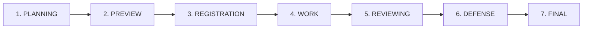

# 📅 QUY TRÌNH 7 GIAI ĐOẠN VÒNG ĐỜI HỌC KỲ (SEMESTER LIFECYCLE)
## HỆ THỐNG QUẢN LÝ KHÓA LUẬN TỐT NGHIỆP (TMS)

Tài liệu này chi tiết hóa các mốc thời gian, điều kiện chuyển đổi giai đoạn, cùng các luồng chức năng chính (Đầu vào, Đầu ra, Xử lý ở cấp độ code và file cụ thể) xuyên suốt 7 giai đoạn trong học kỳ của hệ thống.

---

---

## 🔐 CƠ CHẾ BẢO MẬT & MÃ HÓA CỐT LÕI (JWT & BCRYPTJS)

Trước khi đi vào các giai đoạn, hệ thống sử dụng hai thư viện bảo mật nền tảng chạy xuyên suốt toàn bộ API:

### A. Cơ chế Xác Thực JsonWebToken (JWT)
Hệ thống sử dụng JWT để quản lý phiên làm việc không trạng thái (stateless session).
*   **File cấu hình & Tiện ích:** [src/utils/jwt.ts](file:///d:/thesis/V2/thesis-be/src/utils/jwt.ts)
*   **Cách thức hoạt động:**
    1.  **Cấp phát Token (Đăng nhập):** Khi người dùng gửi tài khoản/mật khẩu hợp lệ, `AuthService.login()` gọi hàm `generateAccessToken()` và `generateRefreshToken()` từ tệp `jwt.ts` để tạo ra hai chuỗi token được ký bằng khóa bí mật `JWT_SECRET`.
    2.  **Đính kèm Request:** Client lưu Access Token và tự động đính kèm vào Header `Authorization: Bearer <Access_Token>` khi thực hiện các cuộc gọi API.
    3.  **Xác thực & Giải mã (Middleware):** Tệp [auth.middleware.ts](file:///d:/thesis/V2/thesis-be/src/middleware/auth.middleware.ts) sẽ chặn các request yêu cầu đăng nhập, gọi hàm `verifyAccessToken(token)` để xác minh tính hợp lệ và thời hạn. Nếu thành công, middleware trích xuất payload (`userId`, `email`, `role`, `departmentId`) và gán vào đối tượng `req.user` phục vụ kiểm tra quyền hạn (RBAC) ở các router tiếp theo.

### B. Cơ chế Mã Hóa Mật Khẩu (BcryptJS)
Hệ thống sử dụng BcryptJS để băm mật khẩu một chiều, ngăn ngừa lộ mật khẩu ngay cả khi cơ sở dữ liệu bị rò rỉ.
*   **File tiện ích:** [src/utils/hash.ts](file:///d:/thesis/V2/thesis-be/src/utils/hash.ts) (Định nghĩa hàm băm `hashPassword` và đối chiếu `comparePassword`).
*   **Cách thức hoạt động:**
    1.  **Khi tạo/import tài khoản:** Trong [user.service.ts](file:///d:/thesis/V2/thesis-be/src/services/user.service.ts) (`importUsers()`), hệ thống tự động băm mật khẩu mặc định (ví dụ: `123456`) bằng dòng code `await bcrypt.hash(password, SALT_ROUNDS)`. Chuỗi kết quả băm phức tạp sẽ được lưu trữ vào trường `password_hash` của bảng `users` trong cơ sở dữ liệu.
    2.  **Khi đăng nhập:** Trong [auth.service.ts](file:///d:/thesis/V2/thesis-be/src/services/auth.service.ts) (`login()`), hệ thống lấy mật khẩu thô khách hàng nhập gửi lên và so sánh với chuỗi băm lưu sẵn trong database bằng hàm: `await bcrypt.compare(plainPassword, user.password_hash)`.

---

## 📂 CHI TIẾT 7 GIAI ĐOẠN HOẠT ĐỘNG

### GIAI ĐOẠN 1: PLANNING (Lập kế hoạch & Chuẩn bị)
Giai đoạn khởi tạo học kỳ mới, cấu hình hệ thống và chuẩn bị dữ liệu người dùng.

*   **Chức năng chính:** Khởi tạo học kỳ; Thiết lập cấu hình mốc thời gian toàn cục; Nhập danh sách Giảng viên và Sinh viên vào đợt làm khóa luận.
*   **Người thực hiện:** `ADMIN` và `HEAD`/`COORDINATOR`.
*   **Chi tiết luồng xử lý trong mã nguồn:**
    *   **Đầu vào (Input):** Tên học kỳ, mã học kỳ (ví dụ: `HK261`), các mốc thời gian giai đoạn và File danh sách người dùng.
    *   **Xử lý trong Code:**
        *   Tạo học kỳ: Hàm `createSemester()` trong [src/services/semester.service.ts](file:///d:/thesis/V2/thesis-be/src/services/semester.service.ts) thực hiện thêm bản ghi mới vào cơ sở dữ liệu qua Prisma Client (`prisma.semester.create`) với trạng thái mặc định `status = PLANNING`.
        *   Tạo tài khoản: Hàm `importUsers()` trong [src/services/user.service.ts](file:///d:/thesis/V2/thesis-be/src/services/user.service.ts) duyệt qua danh sách, gọi `await bcrypt.hash(data.password || '123456', 10)` để mã hóa mật khẩu trước khi lưu bằng `prisma.user.create`.
        *   Phân quyền: Middleware [src/middleware/academic.middleware.ts](file:///d:/thesis/V2/thesis-be/src/middleware/academic.middleware.ts) chặn các vai trò không phải `ADMIN`/`HEAD` thực hiện các thao tác quản trị giai đoạn này.
    *   **Đầu ra (Output):** Học kỳ mới trong bảng `semesters` và tài khoản người dùng được lưu trữ trong bảng `users` kèm `password_hash`.

---

### GIAI ĐOẠN 2: PREVIEW (Đề xuất & Công bộ đề tài)
Giảng viên đề xuất đề tài mới và bộ môn duyệt để công bố cho sinh viên xem trước.

*   **Chức năng chính:** Đề xuất đề tài; Phê duyệt/Từ chối đề tài đề xuất; Mở cổng xem trước đề tài cho sinh viên.
*   **Người thực hiện:** `LECTURER` (Đề xuất), `HEAD` (Phê duyệt) và `STUDENT` (Xem trước).
*   **Chi tiết luồng xử lý trong mã nguồn:**
    *   **Đầu vào (Input):** Đề xuất từ giảng viên (tên đề tài, yêu cầu, số sinh viên) và quyết định duyệt của HOD (`APPROVED`/`REJECTED`).
    *   **Xử lý trong Code:**
        *   Đề xuất đề tài: Hàm `createTopic()` trong [src/services/topic.service.ts](file:///d:/thesis/V2/thesis-be/src/services/topic.service.ts) ghi nhận đề tài mới với `status = PENDING_APPROVAL`.
        *   Duyệt đề tài: Hàm `approveTopic()` trong [src/services/topic.service.ts](file:///d:/thesis/V2/thesis-be/src/services/topic.service.ts) kiểm tra vai trò người gọi có phải `HEAD` hay không, cập nhật `status = APPROVED`.
        *   **Academic Guard:** Hàm `calculateCurrentPhase()` trong [src/utils/semester-guard.ts](file:///d:/thesis/V2/thesis-be/src/utils/semester-guard.ts) xác định phase hiện tại để `AcademicPolicy` cho phép hoặc từ chối hành vi đề xuất/duyệt.
    *   **Đầu ra (Output):** Đề tài chuyển sang trạng thái `APPROVED` và hiển thị trên sàn đề tài cho sinh viên thông qua API `getTopics`.

---

### GIAI ĐOẠN 3: REGISTRATION (Đăng ký đề tài)
Sinh viên thực hiện ghép nhóm và đăng ký đề tài mong muốn thực hiện.

*   **Chức năng chính:** Ghép nhóm tự quản lý; Đăng ký đề tài; Giảng viên duyệt nhóm đăng ký.
*   **Người thực hiện:** `STUDENT` và `LECTURER`.
*   **Chi tiết luồng xử lý trong mã nguồn:**
    *   **Đầu vào (Input):** Lời mời nhóm (`GroupInvite`), yêu cầu đăng ký đề tài từ trưởng nhóm, và quyết định nhận nhóm của GVHD.
    *   **Xử lý trong Code:**
        *   Ghép nhóm: Hàm `createGroup()` và `sendInvite()` trong [src/services/group.service.ts](file:///d:/thesis/V2/thesis-be/src/services/group.service.ts) xử lý logic ghép nhóm và ràng buộc số thành viên.
        *   Đăng ký đề tài: Hàm `registerTopic()` trong [src/services/registration.service.ts](file:///d:/thesis/V2/thesis-be/src/services/registration.service.ts) kiểm tra sĩ số đề tài và tạo một bản ghi `TopicRegistration` mới ở trạng thái `status = PENDING`.
        *   Duyệt nhận nhóm: Hàm `confirmRegistration()` trong [src/services/registration.service.ts](file:///d:/thesis/V2/thesis-be/src/services/registration.service.ts) chuyển trạng thái của `TopicRegistration` thành `CONFIRMED` và tăng sĩ số `current_students` của đề tài đó.
        *   **Academic Guard:** `AcademicPolicy.canPerform('REGISTER_TOPIC')` trong [src/utils/academic-policy.ts](file:///d:/thesis/V2/thesis-be/src/utils/academic-policy.ts) kiểm tra phase đăng ký.
    *   **Đầu ra (Output):** Bản ghi `TopicRegistration` chuyển thành `CONFIRMED`, nhóm sinh viên chính thức thuộc về đề tài khóa luận đó.

---

### GIAI ĐOẠN 4: WORK (Thực hiện đề tài & Đánh giá giữa kỳ)
Sinh viên làm đề tài và trải qua kỳ đánh giá giữa kỳ để lọc các nhóm không đạt.

*   **Chức năng chính:** Nộp báo cáo tiến độ định kỳ; Đánh giá & chấm điểm giữa kỳ.
*   **Người thực hiện:** `STUDENT` (Nộp báo cáo), `LECTURER` (Chấm điểm giữa kỳ - GVHD).
*   **Chi tiết luồng xử lý trong mã nguồn:**
    *   **Đầu vào (Input):** Báo cáo của sinh viên, quyết định chấm đạt/rớt giữa kỳ (`PASS`/`FAIL`) của GVHD.
    *   **Xử lý trong Code:**
        *   Chấm điểm giữa kỳ: Hàm `updateMidtermStatus()` trong [src/services/grading.service.ts](file:///d:/thesis/V2/thesis-be/src/services/grading.service.ts) cập nhật thuộc tính `midterm_status` của sinh viên trong bảng `TopicRegistration` thành `PASS` hoặc `FAIL`.
        *   **Bẫy khóa học thuật (Midterm Failure Lockout):** Nếu giảng viên chấm `FAIL`, hàm này lập tức chuyển trạng thái đăng ký của sinh viên sang `FAILED`. Khi đó, hàm `isTopicFailed()` trong [src/utils/academic-policy.ts](file:///d:/thesis/V2/thesis-be/src/utils/academic-policy.ts) sẽ trả về `true`. Kéo theo tất cả API sau đó (nộp bài, phân phản biện, chấm cuối kỳ) sẽ bị `AcademicPolicy` chặn đứng hoàn toàn đối với sinh viên này.
    *   **Đầu ra (Output):** Thuộc tính `midterm_status` được lưu trữ. Danh sách sinh viên đủ điều kiện đi tiếp sang giai đoạn phản biện được định hình.

---

### GIAI ĐOẠN 5: REVIEWING (Phản biện)
Phân công giảng viên phản biện (GVPB) và tiến hành chấm điểm chuyên môn từ GVHD và GVPB.

*   **Chức năng chính:** Phân công giảng viên phản biện; Nộp báo cáo khóa luận cuối kỳ; Chấm điểm Hướng dẫn & Phản biện.
*   **Người thực hiện:** `HEAD`/`COORDINATOR` (Phân công), `STUDENT` (Nộp báo cáo), `LECTURER` (Chấm điểm).
*   **Chi tiết luồng xử lý trong mã nguồn:**
    *   **Đầu vào (Input):** Phân công GVPB, file báo cáo cuối kỳ, điểm số chi tiết từ GVHD và GVPB theo tiêu chí.
    *   **Xử lý trong Code:**
        *   Phân công phản biện: Hàm `assignReviewer()` trong [src/services/assignment.service.ts](file:///d:/thesis/V2/thesis-be/src/services/assignment.service.ts) ghi nhận phân công vào bảng `assignments` với vai trò chấm là `REVIEWER`.
        *   Chấm điểm cuối kỳ: Hàm `gradeTopic()` trong [src/services/grading.service.ts](file:///d:/thesis/V2/thesis-be/src/services/grading.service.ts) kiểm tra tổng trọng số rubric phải bằng `1.0`, sau đó thêm điểm vào bảng `grades` với vai trò chấm là `SUPERVISOR` hoặc `REVIEWER`.
        *   **Academic Guard:** `AcademicPolicy.canPerform('GRADE_TOPIC')` kiểm tra tuần tự: GVHD bắt buộc phải hoàn tất chấm điểm thì GVPB mới được phép nhập điểm vào hệ thống.
    *   **Đầu ra (Output):** Điểm số chi tiết của từng sinh viên được ghi nhận đầy đủ vào bảng `grades`.

---

### GIAI ĐOẠN 6: DEFENSE (Bảo vệ cuối kỳ)
Tổ chức hội đồng bảo vệ khóa luận và thực hiện chấm điểm hội đồng trực tiếp.

*   **Chức năng chính:** Thành lập hội đồng bảo vệ; Sắp xếp lịch bảo vệ; Chấm điểm hội đồng.
*   **Người thực hiện:** `HEAD`/`COORDINATOR` (Cơ cấu hội đồng & lịch), `LECTURER` (Thành viên hội đồng chấm điểm).
*   **Chi tiết luồng xử lý trong mã nguồn:**
    *   **Đầu vào (Input):** Danh sách thành viên hội đồng, lịch biểu phòng/giờ, điểm số chấm từ Chủ tịch, Thư ký, Ủy viên.
    *   **Xử lý trong Code:**
        *   Tạo hội đồng: Hàm `createCommittee()` trong [src/services/committee.service.ts](file:///d:/thesis/V2/thesis-be/src/services/committee.service.ts).
        *   Sắp xếp lịch: Hàm `createSchedule()` trong [src/services/defense.service.ts](file:///d:/thesis/V2/thesis-be/src/services/defense.service.ts) lưu thông tin lịch phòng vào bảng `defense_schedules`.
        *   Chấm điểm hội đồng: Giảng viên hội đồng chấm qua hàm `gradeTopic()` trong [src/services/grading.service.ts](file:///d:/thesis/V2/thesis-be/src/services/grading.service.ts) với vai trò chấm là `COMMITTEE`.
        *   **Academic Guard:** Hệ thống kiểm tra cờ `is_eligible_for_defense = true` trên đề tài trước khi cho phép lưu điểm hội đồng.
    *   **Đầu ra (Output):** Lịch bảo vệ hoàn chỉnh hiển thị trên hệ thống. Điểm số hội đồng được lưu thành công vào bảng `grades`.

---

### GIAI ĐOẠN 7: FINAL (Tổng hợp & Chốt điểm)
Duyệt điểm cộng, tự động tính điểm tổng kết và đóng học kỳ.

*   **Chức năng chính:** Duyệt điểm cộng NCKH; Tính điểm tổng kết & xếp loại học lực; Chốt điểm công bố; Đóng học kỳ.
*   **Người thực hiện:** `STUDENT` (Gửi minh chứng), `HEAD` (Duyệt điểm cộng & Chốt điểm), `ADMIN` (Lưu trữ học kỳ).
*   **Chi tiết luồng xử lý trong mã nguồn:**
    *   **Đầu vào (Input):** Yêu cầu cộng điểm thưởng, quyết định duyệt của HOD, lệnh chốt điểm học kỳ từ HOD.
    *   **Xử lý trong Code:**
        *   Duyệt điểm cộng: Hàm `approveRequest()` trong [src/services/extra-points.service.ts](file:///d:/thesis/V2/thesis-be/src/services/extra-points.service.ts) cập nhật thuộc tính `extra_points` vào thực thể `FinalScore`.
        *   Tính điểm tổng kết: Hàm `computeFinalScore()` trong [src/services/grading.service.ts](file:///d:/thesis/V2/thesis-be/src/services/grading.service.ts) lấy điểm trung bình của GVHD, GVPB, Hội đồng, nhân trọng số tương ứng và cộng điểm thưởng để tạo thành điểm tổng kết cuối cùng. Sau đó tự động quy đổi xếp loại chữ (A+, A, B+...) và lưu vào bảng `final_scores`.
        *   Chốt điểm: Hàm `finalizeScores()` trong [src/services/grading.service.ts](file:///d:/thesis/V2/thesis-be/src/services/grading.service.ts) chuyển cột `finalized` của tất cả sinh viên sang `true`.
        *   **Academic Guard:** Khi `finalized = true`, `AcademicPolicy` chặn đứng hoàn toàn mọi API chỉnh sửa điểm.
    *   **Đầu ra (Output):** Bảng điểm tổng kết hoàn chỉnh của toàn khóa và trạng thái học kỳ chuyển sang `COMPLETED` để lưu trữ dữ liệu vĩnh viễn.
